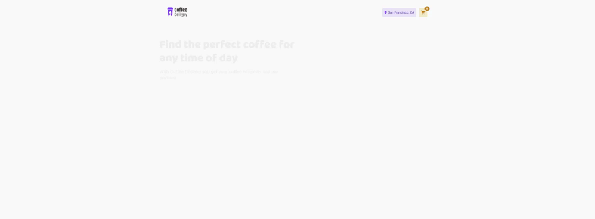

---
<h3 align="center">
  Coffee Delivery
</h3>
 

  
  
  
  

  <a href="#rocket-about-the-challenge">About the Challenge</a>&nbsp;&nbsp;&nbsp;|&nbsp;&nbsp;&nbsp;
  <a href="#technologies">Technologies</a>&nbsp;&nbsp;&nbsp;|&nbsp;&nbsp;&nbsp;
  <a href="#installation">Installation</a>&nbsp;&nbsp;&nbsp;|&nbsp;&nbsp;&nbsp;
  <a href="#memo-license">License</a>

 

---

## :rocket: About the Challenge

The main objective of the challenge is to develop an application to manage a shopping cart of a fictional coffee shop, with the following features:
- List of products (coffees) available for purchase
- Add a specific quantity of items to the cart
- Increase or remove the quantity of items in the cart
- Form for the user fill in his/her address
- Show total cart items in Header
- Show total value of the sum of items in the cart multiplied by the value

## Technologies

- [ReactJS](https://reactjs.org/)
- [Typescript](https://www.typescriptlang.org/)
- [Vite](https://vitejs.dev/)
- [Styled Components](https://styled-components.com/)
- [Framer motion](https://www.framer.com/motion/)
- [Axios](https://axios-http.com/)
- [Zod](https://github.com/colinhacks/zod)
- [React-toastify](https://fkhadra.github.io/react-toastify/introduction)
- [mswjs](https://mswjs.io/)
- [geoapify](https://www.geoapify.com/)

## Installation

1. Clone the repository: `git@github.com:matheus-neves/coffee-delivery.git`
2. Access the directory: `cd coffee-delivery`
3. Duplicate the .env-example file found in `/src`, after renaming it to .env
4. You'll need to create an API key at https://www.geoapify.com
5. After you got the key, open the .env file that you had created and add this on `VITE_API_GEOAPIFY_KEY`.
6. Install the dependencies: `yarn`
7. Run the app: `yarn dev`

## :memo: License

This challenge is under license from MIT. See the archive [LICENSE](https://github.com/matheus-neves/coffee-delivery/blob/main/LICENSE.md) for more details.

---

Challenge completed :heavy_check_mark:

Made with 💜 by Matheus Neves [See my linkedin!](https://www.linkedin.com/in/matheus-neves-front-end/) :wave:
